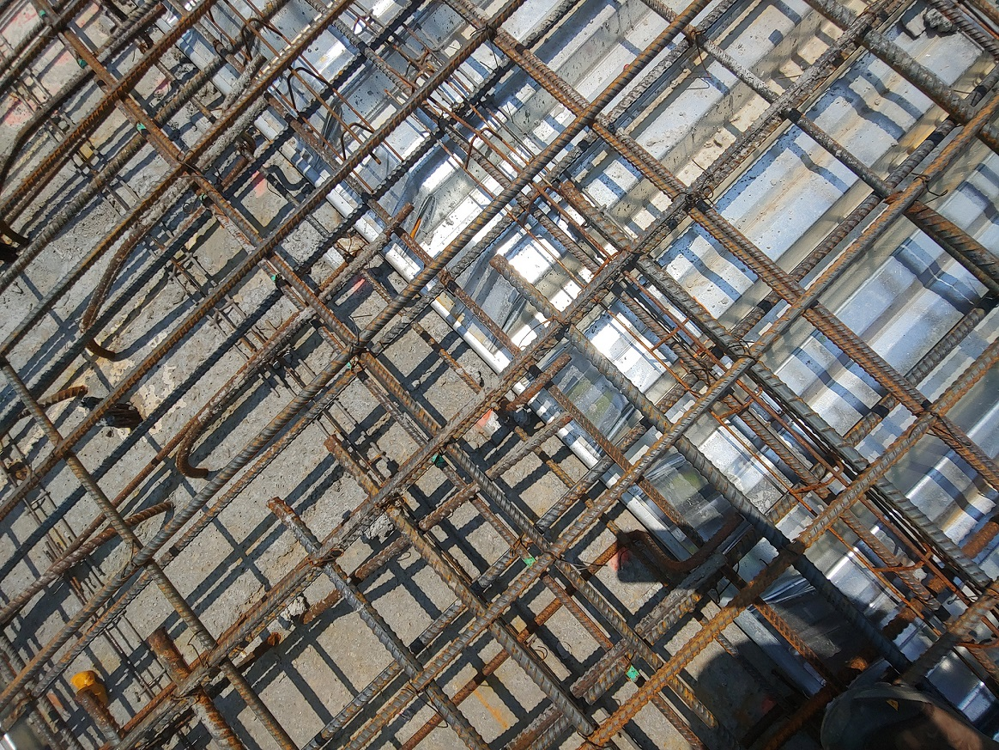

## Business Development

Rebar is used in concrete structures to help with strength. Concrete is good in compression, but not in tension (rebar helps with this). They are steel rods that come in various sizes and typically called out by a number where the size is number/8 inches so a #4 bar is 0.5 in diameter. There are few differnt alloy steels used in rebar including a stainless type of bar. Bars need to be tied so that they do not move during the pour as the orientation of bars play an important role in how loads are transmitted through the structure. Below is a bridge deck compared to slab on grade application. Slab on grade here being from the ground level of a parking garage and the bridge deck being from a US interstate highway section.

| Bridge Deck | Slab on grade |
| :---: | :---: |
|  |  |

On the business front I was able to source a MoU[^mou] from the executive team of one of the largest mid-sized construction equipment manufactures with benchmarks for working toward a sales and distribution agreement, investigated working with one of the rebar companies bidding on the Howard Franklin Bridge[^HowardFranklin] project in Tampa, FL , and conducted multiple calls / site visits with rebar installers across the US working to understand pricing targets and product tradeoffs. The overarching goal for the system was to gain as many learnings as possible to feed into refinements of the business pitch, the design targets for a future iteration (should that have been the direction), and meet objectives of the research grant that was being worked under. 

Ultimately, we were not able to get rebar installers interested in adopting this system. We did have pull from the trades, a distribution and service route lined up, and pull from the general contractors (who would have benefited the most from this type of system with time savings). Some projects we found that the system would have paid for itself at the GC level in one project with the schedule risk reduction, but the return on investment was not always there and not compelling enough for the rebar installers. As such we had trouble making any type of sale or rental agreement. This type of payee beneficiary relationship can come up in healthcare and construction[^sublayers]. A number of construction tech startups run into this and struggle with adoption even though the tech and the impact look very promising at a high level. It does seem that this will dynamic will improve as labor rates and insurance rates continue to increase possibly by the 2030s the conditions will be more favorable for adoption. Until costs tip the scale at the subcontractor level, vertically integrated construction companies and large integrated subcontractors will be the best place to adopt most of the more automated construction technologies. 

Automating rebar tying requires large square footage, high tie coverage and close rebar spacing that is often seen on bridge decks, certian foundations, and water infrastructure projects. It can end up also being a relatively too niche portion of the total rebar install market. This lacks the scale and trajectory of what typical venture investment may look for. Tying is also one of many tasks rodbusters must do on a project and you will not decrease the size of crew as minium crew size can be dictated by other tasks such as flying in cages, breaking down after crane picks, etc. Automated tying can present an opportunity for division of labor tasks to speed up install, but the impact of this is dependent on project size and it was observed in modeling that even some of the smallest bridge decks aren't quite big enough[^fhwa]. 

[^sublayers]: I think this can be true for any industry where there might be multilayer chains of subcontractors or suppliers. I would caution startups who find themselves in such a market. Typically, the US healthcare system is given as an example, but here I found that construction can be similar on this front. 
[^mou]: Memorandum of Understanding
[^HowardFranklin]: At the time [Howard Fanklin Bridge](https://en.wikipedia.org/wiki/Howard_Frankland_Bridge) project was the largest upcoming bridge project in the USA. Several miles long and multiple lanes wide. 
[^fhwa]: [National Bridge Inventory](https://www.fhwa.dot.gov/bridge/nbi.cfm) Has a data set of all bridges in the US. Note that while the smallest aren't the best fit there are plenty of large bridges which need attention. 
