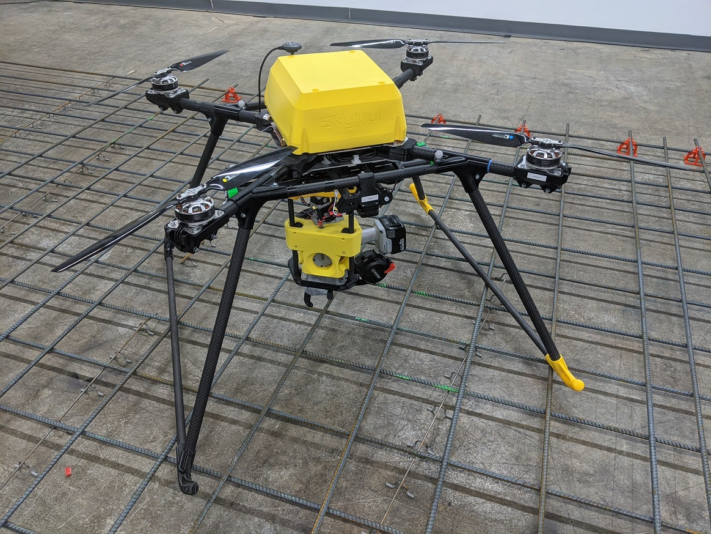
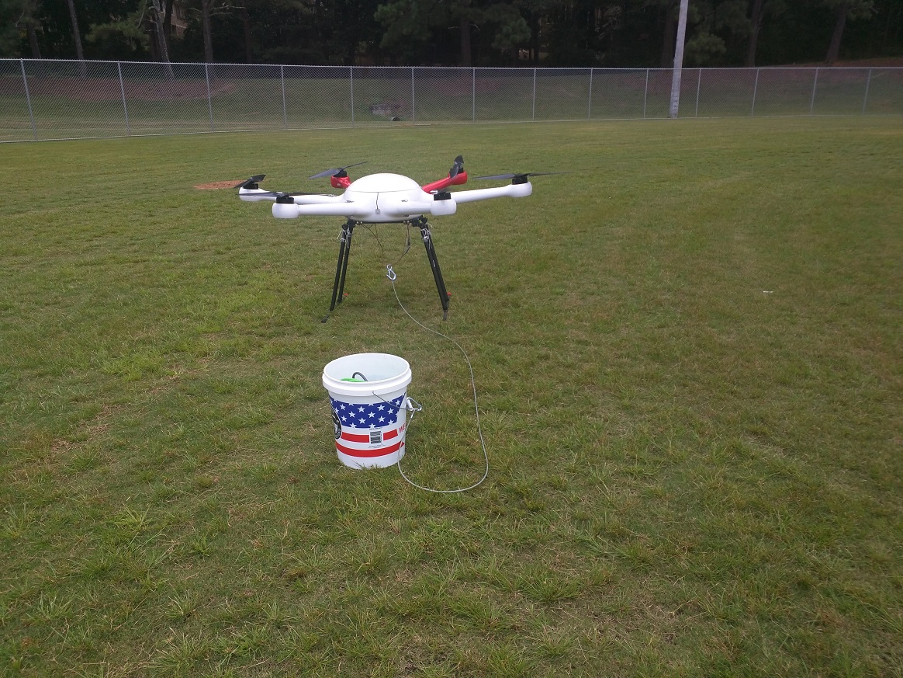

## Robotic Drone for Rebar Automation

From 2018 to 2022 I worked on a construction technology startup which pivoted to the rebar / reinforced concrete space. Initially we had looked at onsite logistics for construction sites using drones to move items less than crane picks around sites. After several sites visits and combing through months of OxBlue cameras[^oxblue] from multiple jobs sites it was found that rebar work seemed to be consistently on the critical path. This pivot occurred during The Farm startup accelerator hosted by Comcast[^comcast] Central Division and Boomtown[^boomtown]. 

Representing a 3rd iteration of the system. This iteration was started after a demo event in November of 2019 where we were invited to present as part of a Verizon disaster response exercise demonstrating how next generation wireless networks will enable rebuilding infrastructure with tools such as robotics and intelligent machines after a wildfire. This event provided us with a sand box environment for the better part of a week. Outside of the demos for the event we were able to conduct systems tests till we ran out of daylight each day gaining valuable insights on deployment, field ops, and needed refinements to many of the subsystems. Many of these elements were only uncoverable by deploying the system and this event greatly sped up development. 

| Exercise Demo | Test Near Sunset |
| :---: | :---: |
|  |  |

The development started immediately in December and was first assembled in mid-January of 2020 for display at World of Concrete[^woc]. Following the January trade show, development efforts in 2020 focused on iterations to the tooling system, sensor integration testing, and flight control. For comparison, P3 was a big jump in size compared to P2. P2 could fit under P3. For the hardware my focus was on mechanical design, system architecture, harnesses, and sensor selection & placement. I was also focusing on business development efforts such as customer interviews, performance studies for benchmarking, discovery of ways to service customers such as development of a sales/support channel.  Efforts were split across getting progress on as many fronts as feasible be it hardware development or business development.

[Business Focus](BusinessFocus.md)

[Hardware Development](HardwareDevelopment.md)

[^oxblue]: [OxBlue](https://www.oxblue.com/) A brand of timelapse cameras for construction sites. A few construction companies were annoyed enough that they gave us links to their camera feeds for sites and told us to knock ourselves out. 
[^woc]: [World of Concrete](https://www.worldofconcrete.com) The second largest trade show annually held in Las Vegas and the largest tradeshow dedicated to construction and a leading building material used by humanity for the past 2,000+ years. 
[^comcast]: [Comcast](https://corporate.comcast.com/)
[^boomtown]: [Boomtown Accelerators]( https://btinnovation.com/)
